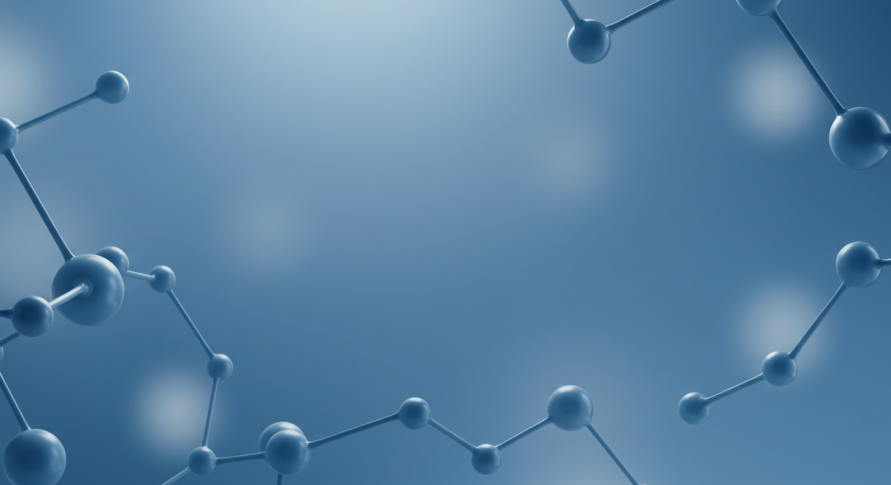
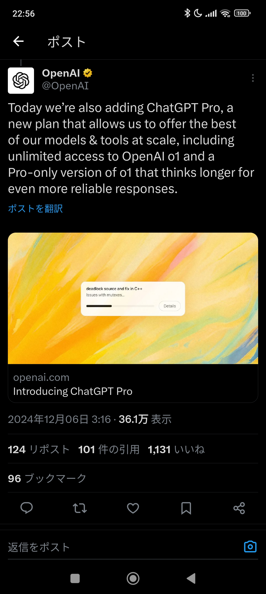
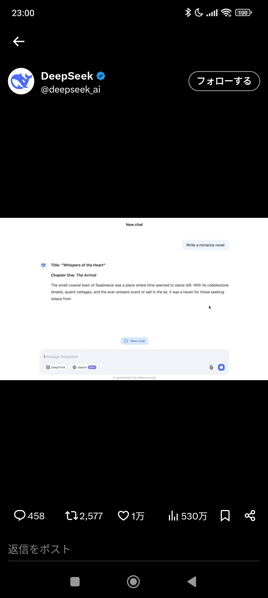
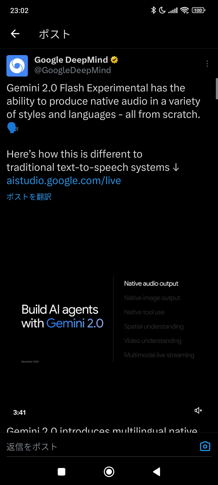
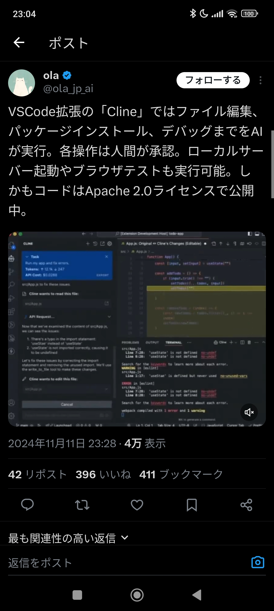
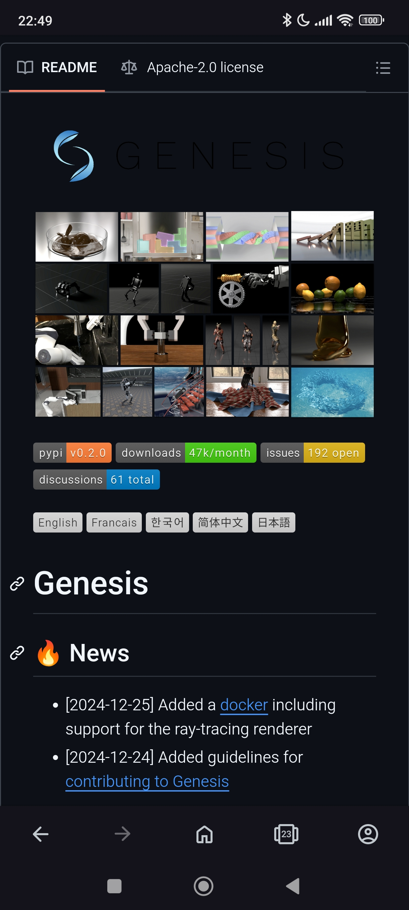
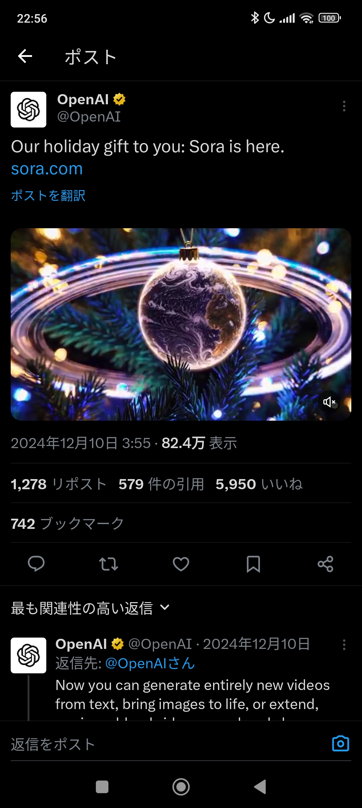
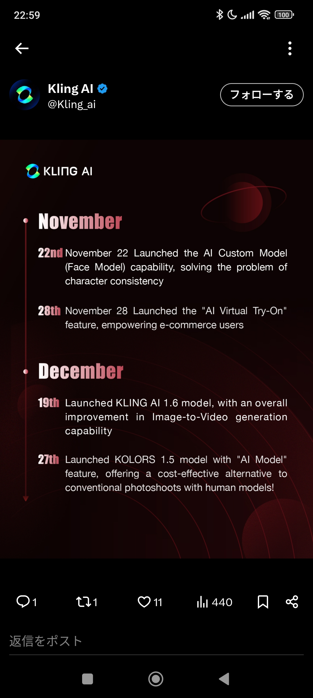

<!-- _color: white -->
<!-- _header: '' -->
<!-- _footer: '' -->

# AI Trends 2024-2025
### 年末年始のAI動向と各種ツール

---

<!-- _color: white -->
<!-- _header: '' -->
<!-- _footer: '' -->

## トレンドの変化
- **2024年**: RAGが主流
- **2025年**: AIエージェントへシフト(自律的なタスク完了)

## 技術革新の加速
- **ポジティブフィードバック**: AIエージェントによる効率化が検証速度を加速
- **高性能モデル**: 推論に計算コストを投じる高性能モデルが登場
  - OpenAI o1、Gemini 2.0 Flash thinking、DeepSeek-V3 Deepthink

## 産業への影響
- 物理シミュレーション: Genesisiにより革新的な進歩
- 化学業界: 大きな変化なし

---

# o1 pro mode - OpenAI

- 高度な思考力を持つAIモデル
- **特徴**:
  - 数学・プログラミングに特化
  - 科学研究分野で高性能
  - 複雑タスクの安定処理
- ChatGPT Proプラン（月額3万円）で利用可能
- 複雑な現象の整理と本質の考察が素晴らしい

---

# DeepSeek-V3

- 中国DeepSeek社の最新LLM
- **モデル詳細**:
  - 6710億パラメーター
  - 14.8兆トークンでトレーニング
- **特徴**:
  - OSSなのにGPT-4o並の性能
  - コストはGPT-4oの1/10
- 体感性能はGPT-4o以下だが、圧倒的なコスパ

---

# Gemini 2.0 Flash Thinking

- Google開発の推論強化AIモデル
- **特徴**:
  - 思考プロセスの可視化
  - 強化された推論能力
- Google AI Studioで無料提供
- 無料のAPIで使えるモデルでは、確実に最高性能

---

# Deep Research - Google

- Gemini 2.0搭載のリサーチ支援機能
- **主な機能**:
  - 包括的な情報収集
  - 自動分析・レポート生成
  - Googleドキュメント連携
- 有料なので試していないですが、Googleの検索能力を活用し好評
- Bing、Gemini、Felo、Perplexity、Genspark、Elicitなど検索系AIエージェントは多数あり

---

# Cline

- AIエージェント(VSCodeの拡張機能あり)
- **機能**:
  - 自然言語からの自動コード生成
  - 各種API使用可能(GPT, Gemini, Claude...)
  - ファイル、ディレクトリ操作も全自動化可能
- GeminiのAPIを使えば、無料で試せる
- 信じられないくらい便利だが、社給PCでは無理

---

# Browser-use

- AIブラウザ自動操作ライブラリ
- **主要機能**:
  - ウェブ要素の抽出
  - フォーム操作の自動化
  - テキスト入力の自動化
- **対応LLM**:
  - GPT、Claude、Geminiなど各種API使用可
- ほぼPCを乗っ取られているので、社給PCでは無理

---

# Genesis

- カーネギーメロン大学発の物理シミュレーター
- **シミュレーション機能**:
  - 剛体/軟体の物理演算
  - 接触力学
  - 流体の近似計算
- 現実世界の43万倍で演算可能
- 犬型ロボットやロボットアームの制御の実例多数

---

# Sora - OpenAI

- テキストや画像から高品質な動画を生成
- **スペック**:
  - 最大1080p解像度
  - 最長20秒の動画生成
- **機能**:
  - リミックス/リカット
  - ストーリーボード編集
- 高性能だが、事前の期待値は超えられなかった

---

# Kling1.6- Kuaishou

- 中国発の高性能動画生成AI
- **スペック**:
  - 最大2分間/30fps
  - 1080p高画質出力
- **特徴**:
  - アジア人顔の高い再現性
  - リップシンク機能搭載
  - コミュニティ機能
- 体感はsora以上の高品質な動画を生成

---

<!-- _color: white -->
<!-- _header: '' -->
<!-- _footer: '' -->

# まとめ

- 動画生成AI: SoraとKling1.6が高品質動画生成を実現
- 次世代LLM: OpenAI o1、Gemini 2.0、DeepSeek-V3が性能向上
- 研究支援: Deep Researchなど検索系AIエージェントが効率化を促進
- 開発支援: Cline、Claude MCPとbrowser-useが自動化を加速
- 物理演算: Genesisが超高速シミュレーションを実現
